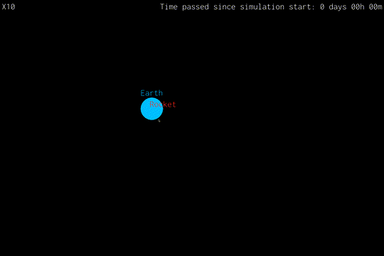
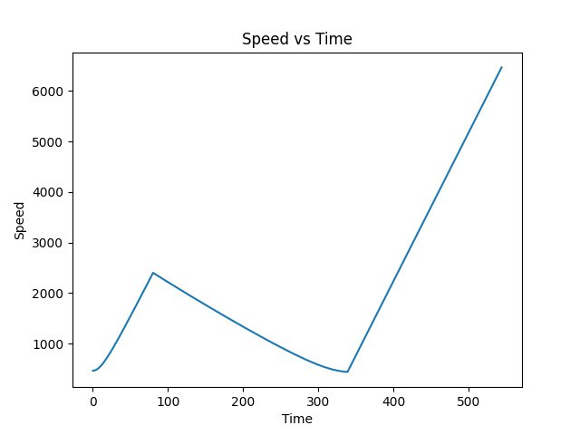
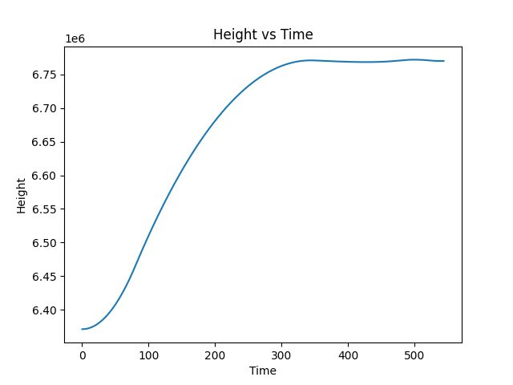
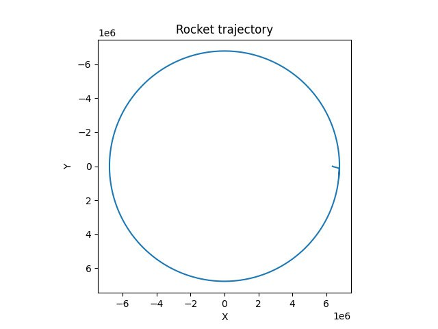

# Kabal space program


## Demo



## Run

We recomend to use `virtualenv` to run it:

```bash
python3 -m venv .env
. .env/bin/activate
pip3 install -r requirements.txt
cd simulator
python3 main.py
```

Show help message:

```bash
python3 main.py --help
```

## Building graphics






You can use `-g` or `--build-graphics` option to build graphics when rocket lands.

```bash
python3 main.py --build-graphics
```

## Configure

Confige file: `simulator/config.py`.

## Hotkeys

- `c` - show/hide entities text markers
- `h` - show/hide gui widgets
- `w`, `a`, `s`, `d` and arrows for navigation
- `+`, `-` for scale
- `mouse` for navigation and scale
- `[`, `]` - to change time acceleration
- `space` - pause